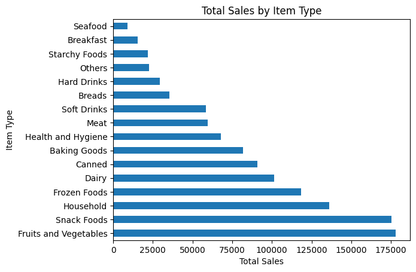
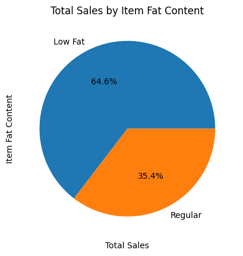
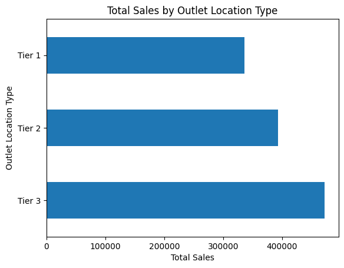
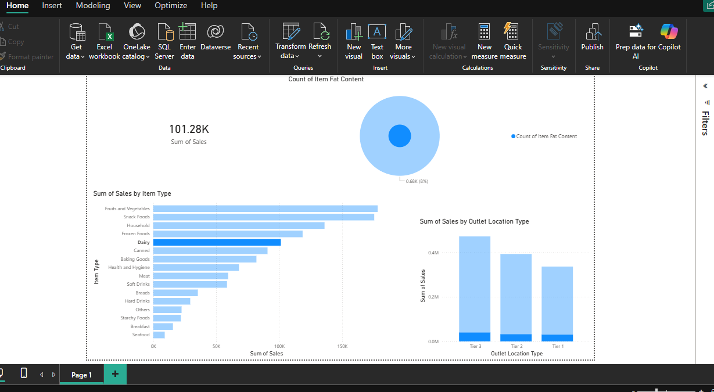
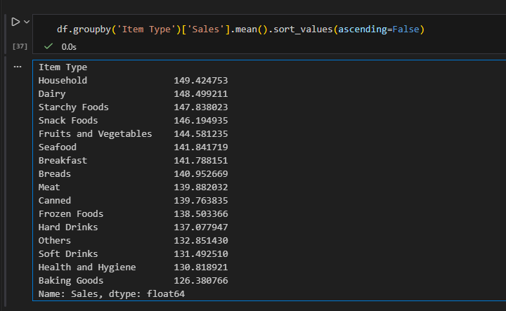
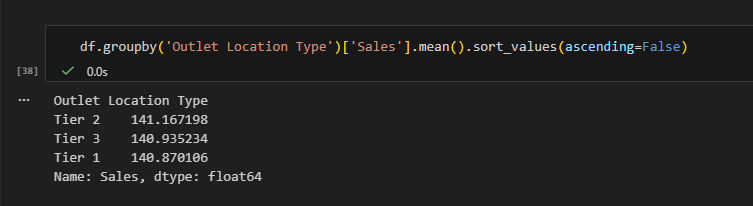
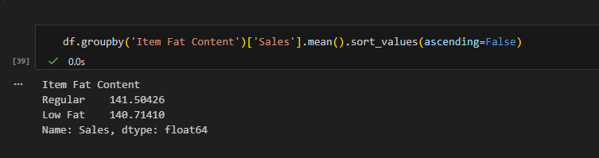
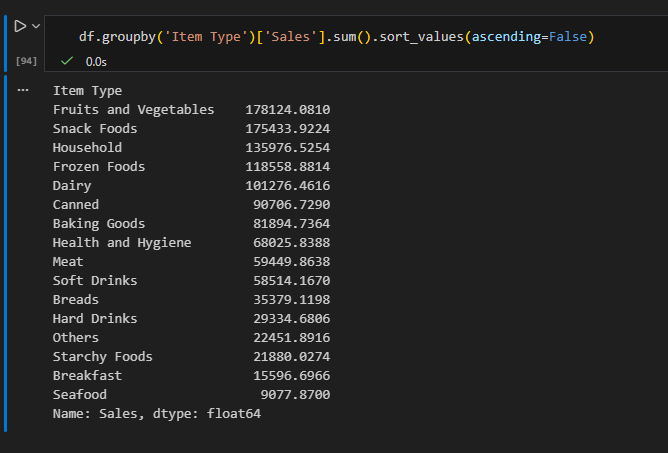
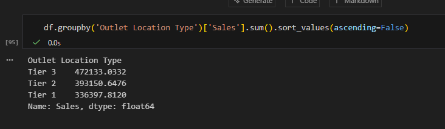
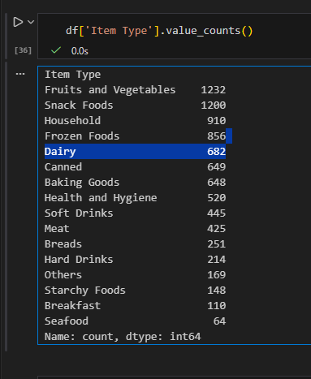

## Project Overview
This project analyzes grocery sales data to discover patterns in product categories, outlet types, and fat content demand.

## Tools Used
- Python (Pandas)
- Matplotlib
- Power BI

## Data Cleaning
- Handled missing values in Item Weight
- Standardized Fat Content categories
- Removed duplicates
- Prepared dataset for analysis

## Exploratory Data Analysis (EDA)

### Sales by Item Type

### Sales by Fat Content

### Sales by Outlet Location

## Dashboard

### Average Sales by Item Type
From the analysis, **Household, Dairy, and Starchy Foods** have the highest average sales among all product categories.

### Average Sales by Outlocation 

### Average Sales by Fat Content
Analysis shows that **Regular fat products have slightly higher average sales** compared to Low Fat products.

### Total Sales by Item Type
The categories generating the **highest overall revenue** are:
- Fruits and Vegetables
- Snack Foods
- Household

###Totals Outlet Location

###Total Values Count

## Key Insights
- Certain product categories generate significantly higher sales.
- Outlet location type affects total revenue.
- Low Fat and Regular products show different sales distribution.
  
  

## Repository Structure
- **data/** → cleaned dataset  
- **notebooks/** → Python analysis code  
- **images/** → charts and dashboard screenshots

## Author
Aayush Sharma
